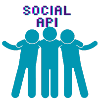

# Social Network API


The Social Network API is a backend technology that has been built to accomodate the core functions of a social media network. Become a user, make some friends, and post away!

## Description

The Social Media API is a NoSQL-based probram that uses MongoDB as well as Node and Express to bring you accurate API calls and ease of use. 

With thoughtful controllers to describe functionality:


Models to represent our controllers


and API routes to tie it all together.


Our index.js and connection.js serve as the code behind the API server and Database server respectively. 


## Getting Started

### Dependencies

* Express.js
* MongoDB
* Mongoose
* Nodemon

### Executing program

First, install the necesarry packages using the command 
```
npm i
```
Then, seed your database using 
```
npm run seed
```
Finally, start your server with:
```
npm run start
```
### Video Tutorial and Github

Click here for the video tutorial for the Social API:

To see this project on Github, click here: 

## Authors

Samantha Gosselin is a fullstack web developer based in Austin, Texas. You can view her work on [github](https://github.com/Samanthag2009) or connect on [linkedIn](https://www.linkedin.com/in/samantha-gosselin-37493517/)

## Version History

* 0.1
    * Initial Release

## Acknowledgments

Readme Template:
* [awesome-readme](https://github.com/matiassingers/awesome-readme)

Tutorial on connecting to MongoDB in Node.js:
* [The Net Ninja](https://www.youtube.com/watch?v=gGNquGHqpNI)

